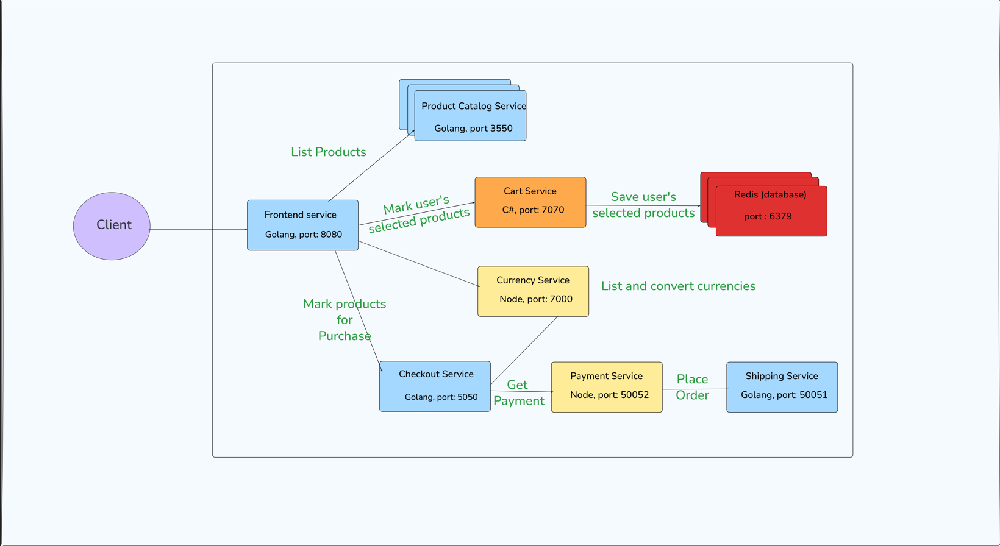
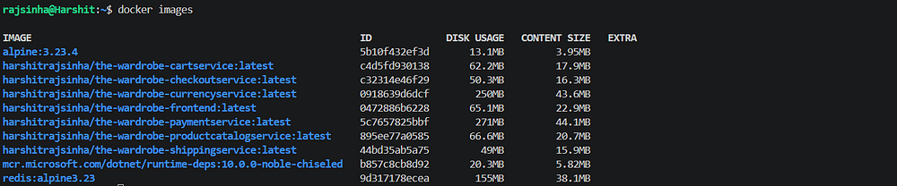
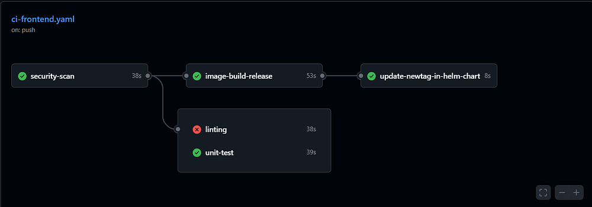
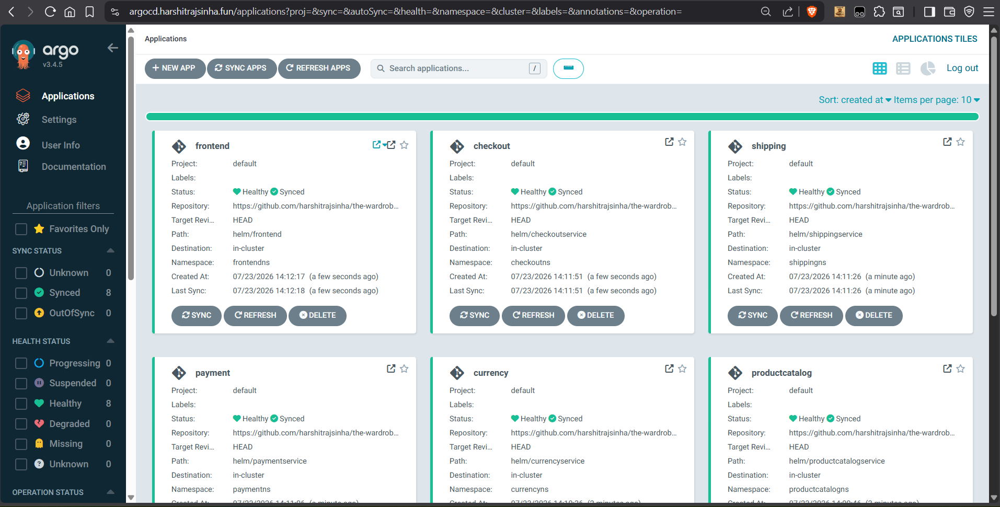
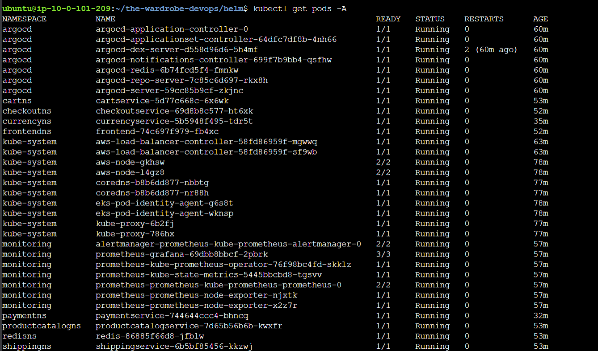
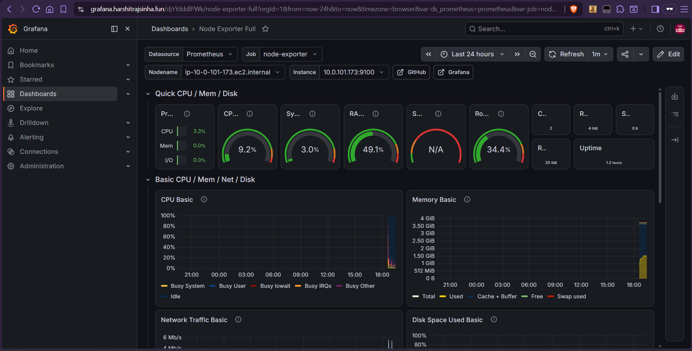
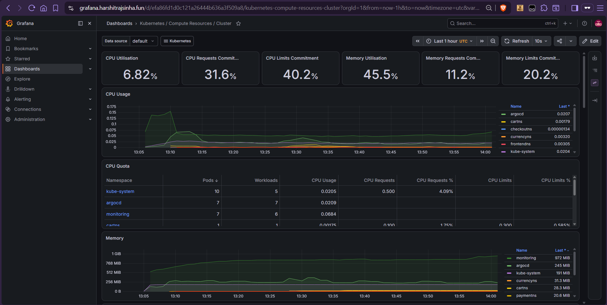

Through this project [harshitrajsinha/the-wardrobe-devops](https://github.com/harshitrajsinha/the-wardrobe-devops) I aim to showcase my knowledge and skills in applying DevOps practices to a microservices application, primarily focusing on deploying the application to Kubernetes (AWS EKS) using Helm and ArgoCD 👍

 

 

# <a name="devops">Devopsifying the project</a>

### 🐳 Dockerizing microservices

Each microservice has its own Docker image, which is used to create containers running inside Kubernetes pods. These images are built by following Docker best practices, such as using a minimal base image, leveraging multi-stage builds (where applicable), running containers as a non-root user, and applying additional optimizations to improve build performance, enhance security, and reduce image size. Each microservice has its own dedicated ECR repository with an independent lifecycle policy that automatically removes untagged and stale images, helping keep repositories organized while reducing storage costs.

 

### 🏗️ Terraform (Infrastructure as Code)

The entire cloud infrastructure is provisioned and managed as code using Terraform, enabling a consistent, repeatable, and version-controlled deployment process across AWS, Kubernetes, and Helm resources. To maintain the quality and security of the infrastructure code, every change passes through an automated CI pipeline that performs secret scanning, formatting, validation, linting, and vulnerability scanning before it can be merged. This Infrastructure as Code (IaC) approach ensures that infrastructure changes are reliable, secure, and compliant with best practices while reducing the risk of configuration errors and security vulnerabilities.

### 🔄 Continuous Integration using GitHub Actions

 

For each of the microservices, a typical CI flow looks like - 
Code commit? → Security scan (secrets scan, dependency scan, filesystem scan, SBOM generation) → Linting → Unit tests → Image build and release (ECR config, image build, image scan, SBOM generation, image push to ECR) → Update image tag in helm/

### 🐙 Continuous Delivery using GitOps (ArgoCD)

 

ArgoCD, integrated to project lifecycle, performs the action of deploying all the microservices on EKS cluster nodes and reconcile considering project repository on GitHub as the single source of truth. The HTTPS endpoint for ArgoCD is exposed through an ingress for accessibility. Each service folder in helm/ directory of the GitHub repo is considered as source of truth by ArgoCD for reconciliation. The CI pipeline after succcessfully building the image and pushing it to AWS ECR, updates the values.yaml file of respective microservice in helm/ directory.

### ☸ Container Orchestration using Kubernetes

 

The entire infrastructure is deployed on AWS EKS, where the control plane is managed by AWS, while the worker nodes are managed through a node group containing two EC2 instances. Of the eight microservices, only the frontend is exposed externally using the AWS Load Balancer Controller, which is configured with an IAM OIDC provider and a Kubernetes service account. 

### Observability

 

 